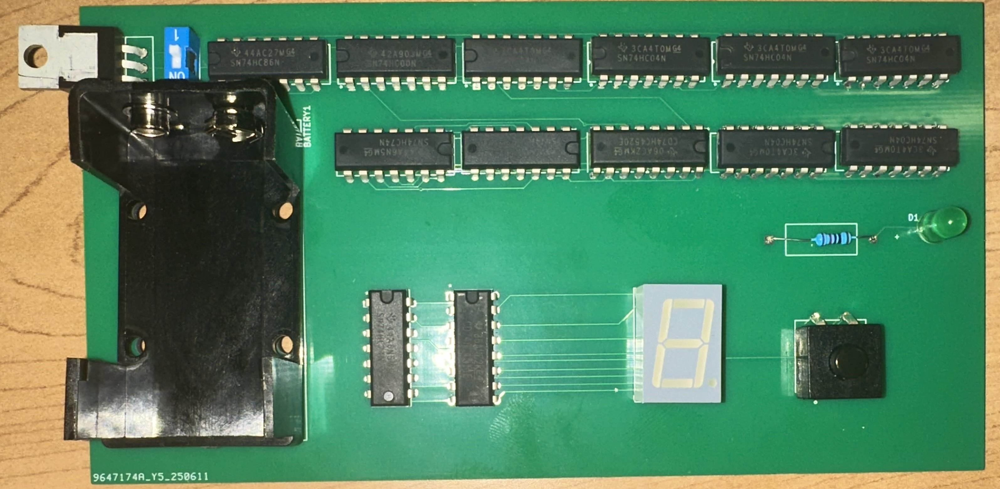

### asperkins42 Hardware Trojan Documentation (v2)

## What does it do?
This circuit, under normal operating conditions, was designed to be a pseudorandom number generator that could roll anywhere between 0 and 7 (inclusive). This is meant to act as a potential "dice roller" for a game like Yahtzee, Monopoly, etc. When the Trojan is activated via the switch, the dice lock up, and no numbers are able to be rolled until the Trojan is deactivated. This showcases how malicious hardware could potentially be inserted to rig a game in one's favor. 

## Circuit Behavior (Engineering Terms)

  
   
  <em>Figure 1: Breadboard Hardware Trojan Design part 1</em>

In Figure 1, you can see the majority of the Hardware Trojan circuit. 
Beginning at the top left, we have the XOR chip. This chip acts as an enable for the ring-oscillator part of this circuit. When the Trojan is not active, the XOR gate outputs a 1, allowing the ROs to begin oscillation. When the Trojan goes high, the XOR output changes to 0, which stops the oscillation of the ring oscillators. Two of the four available XOR gates are used in this circuit. 

The chip to the right of the XOR gate is a NAND gate. This acts as the first stage of the ring oscillator and allows the oscillators to be turned on and off. Two NAND gates are used, one for each of the ROs. 

The remaining six chips on the top row are the rest of the ring oscillators. The top row uses all available inverters (3 per side, per chip) for a total of 18 inverters + the NAND gate on top, giving the top RO 19 stages. The bottom RO has only 17 stages, leaving out the last two inverters of the last chip. This is done so that the oscillations have a larger variance in frequency. When we tested with two ROs of the same length, the output on the seven-segment display only ever read 0 or 7, since the signals were too close in frequency and would be all 1's or all 0's after the D-Flip Flop stage (we will discuss that in a moment).

On the second row, the first chip is a counter. Each RO feeds into the input of the counter, and the most significant outputs of the two counters are used as inputs for the first three D-Flip Flops (The top row of the next three chips). One counter controls the input to the first of the three streaming DFFs, while the other counter controls all three of the clocks. This makes it so that on every clock edge, the input advances one stage. The second set of DFFs (the bottom row of the same three chips) handles the storage of the current value. The output of the top three DFFs feeds into the input of the bottom three DFFs, and these are clocked by a button (that I have just noticed is absent from the picture, but would connect the red (5V) wire to the white wire at the end of the breadboard we are currently on). When this button is pressed (twice), the value that is currently being output by the top three DFFs is locked into the bottom three DFFs and is output on their Q pin. These three bits are then fed into a hexadecimal decoder (the final black IC on this breadboard) whose most significant value is held to 0V. The outputs of this decoder are connected to the seven-segment display as shown. The green LED was used in debugging and did make its way into the final PCB design. All it does is illuminate when the button is pressed. 

## Circuit Behavior (Non-Engineering Terms)
Essentially, this circuit has two paths that race each other, and based on which signal wins the race, either a 1 or a 0 is output. These 1's and 0's are stored in a 3-bit first-in first-out buffer, meaning that 3 bits are stored at a time, and when a new bit arrives, the oldest bit leaves. These 3 bits are used to represent the integers 0 through 7, and every time the button is pressed (twice), a snapshot is taken of the current three bits and set aside to be decoded. The decoder looks at the three bits, determines what number they represent, and sends it to the seven-segment display so that a human can read it. 

The Trojan in this circuit stops the racing signals in the two paths. The first black chip in the top left (to the right of the switch) is called a XOR gate, and when the Trojan is not active, it enables the racing signals. Once the Trojan is activated via the second blue switch, a ~10-second timer starts, and once it expires, the XOR gate disables the racing signals. This causes the buffer to hold the three bits it has in it, and the number on the seven-segment display no longer changes. 

## Trojan Activation 

  
   
  <em>Figure 2: Breadboard Hardware Trojan Design part 2</em>

In Figure 2, you can see the bottom two breadboards, where not much is going on. Breadboard 3 houses the on/off switch for the Trojan, along with the AND gate, the capacitors, and the resistors that make up the Trojan. When the switch is turned on, 5V is supplied to the AND gate and the RC circuit. The RC circuit has a time constant (around 10 seconds) so that once the capacitor fully charges, both inputs to the AND gate go high, resulting in a 1 being output. The 1 is then propagated to the XOR gates from the beginning, which locks the circuit into whichever number was currently rolled. 

The bottom breadboard simply has a voltage regulator that takes in 9V and outputs 5V. 

## Variations Compared to PCB

The PCB version of this Trojan works in the same way; there are simply a couple of variations to the layout. First off, the layout is similar to the breadboard, but had to be adapted to fit the 9V battery and its housing. An additional switch has been added between the 9V battery and the voltage regulator, allowing the user to switch off the device if desired. 

There are two versions of the PCB. One is a clean version, with no Trojan on the board at all. The other is an "attacked" version that has the Trojan on board, which is still activated by the switch. These two versions can be seen below as circuit diagrams. Below, in Figures 3-6, you can see the circuit diagram and the actual PCB implementation of both the Trojan-free and Trojan boards.

  
   
  <em>Figure 3: PCB for Circuit with Hardware Trojan</em>

  

  
   
  <em>Figure 4: Schematic for Circuit with Hardware Trojan</em>

   

  
   
  <em>Figure 5: PCB for Circuit without Hardware Trojan</em>

  

  
   
  <em>Figure 6: Schematic for Circuit with Hardware Trojan</em>

## Standard Operating Procedure

1. Place a 9V battery into the battery holder.
2. With the board oriented so that the battery is in the bottom left corner, flip the switch to the active (ON) position. Note: the switch we have chosen to use is marked strangely, with an "on" position and a "1" position. Know that the board is on and active when the seven-segment display is lit. 
3. Press the button two times to "roll" the dice.
4. To enable the Trojan, flip the other switch to the active (ON) position. After 10 seconds, the number displayed on the seven-segment display will no longer change. To disable the Trojan, simply flip the switch back to the inactive position.
5. To turn the dice roller off, flip the other switch to the inactive (1) position.
   

## Things to note!
The Trojan activation does not work exactly as planned. The time it takes from Trojan trigger to activation was calculated to be ~4 seconds, but in the actual implementation, it is more like 10 seconds. 

Originally, the roller was supposed to activate upon each button press. For some reason, potentially due to the button choice, it activates every two button presses. The documentation has been updated to reflect this. 

When rolling the number, you may notice that there are certain numbers that appear more frequently than others. This is a pseudorandom number generator, meaning it is not truly random; it just appears to be. We have been able to get all 8 possible numbers in testing, but some occur much less often than others. 
